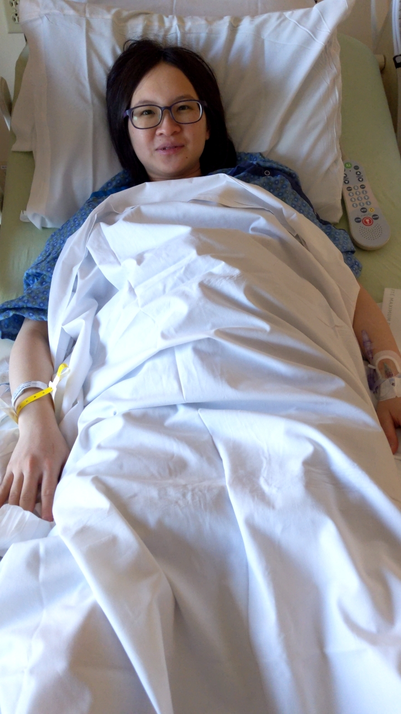
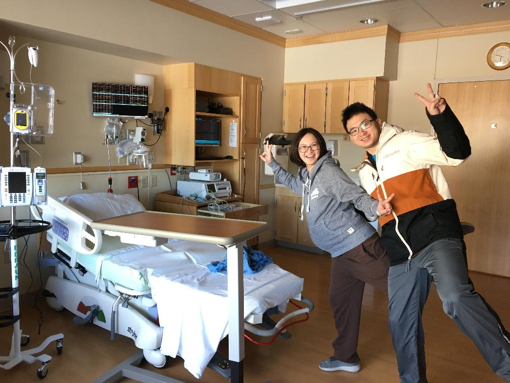
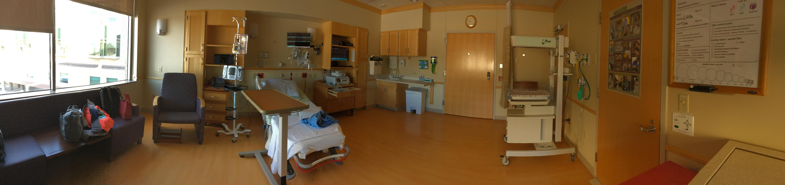
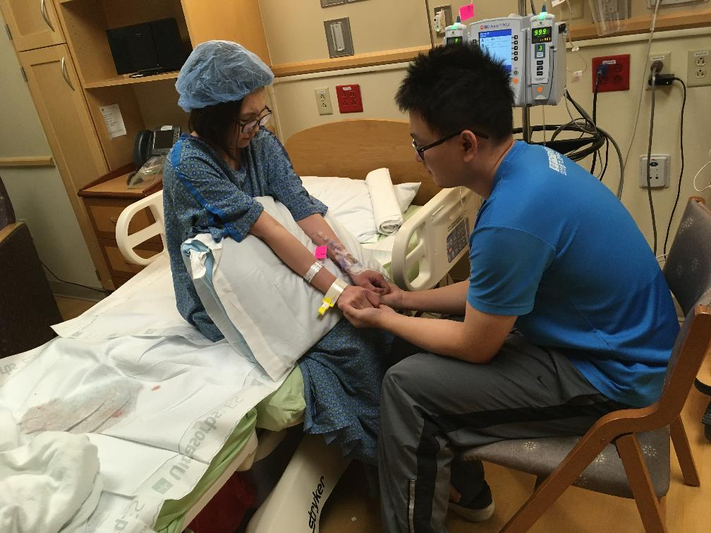
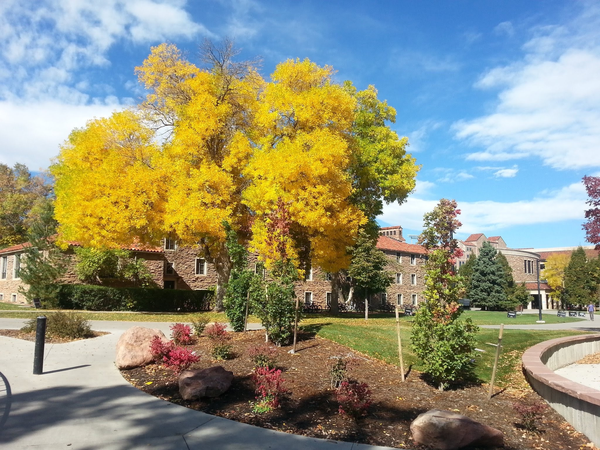
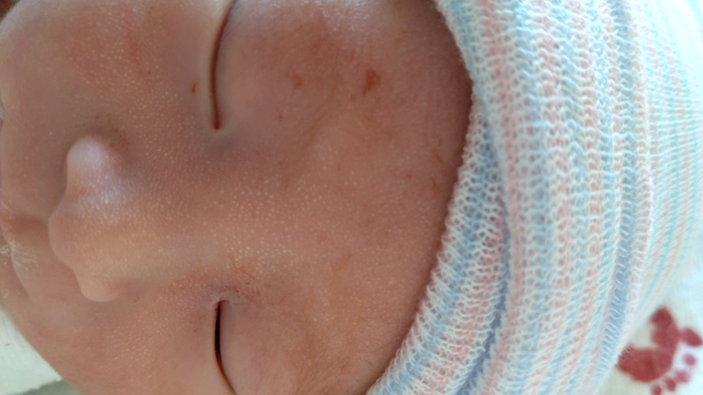
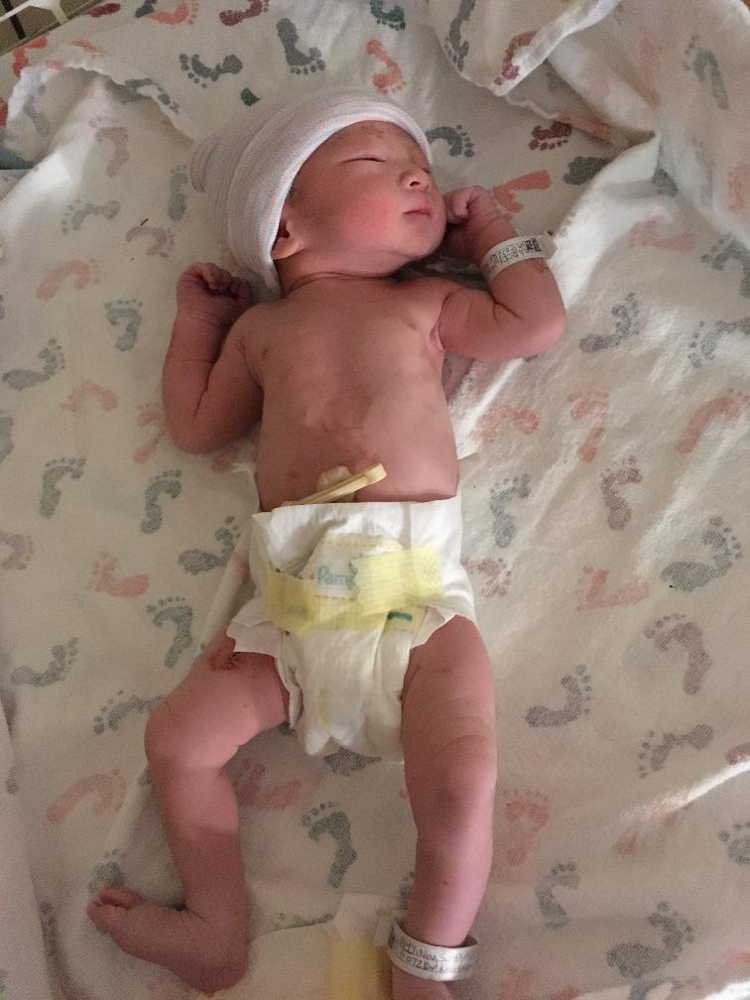
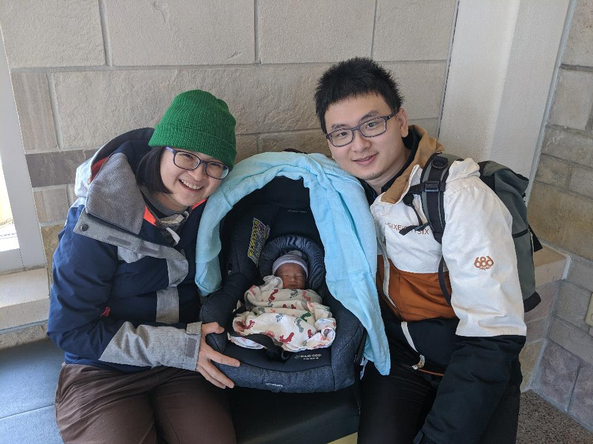
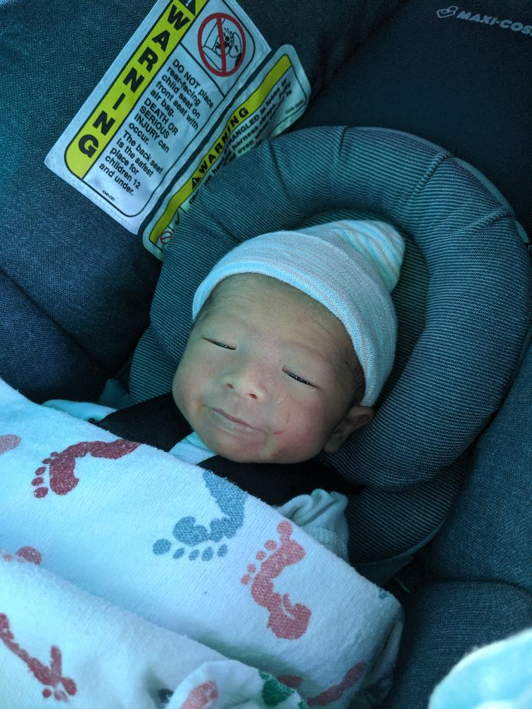

## 溜溜出生記
溜媽總想幫小孩找個主題曲，最好還能跟姓氏有搭配，最後腦洞大開想了溜溜來配合烏溜溜，念起來也挺順口的，所以後來就給溜溜取了英文名字 Leo 了！這次能在 Boulder 生下溜溜也算是難能可貴的經驗，一定要好好紀錄一下。

我們就從溜媽開心的待產開始吧 XD 一開始進去真的像是住飯店一樣輕鬆，完全不明白接下來要面對什麼樣的狀況。生產大飯店大概長得這樣：

然後我們也真的玩起來了 XD
<figure>
    
</figure>
因為溜溜長得比較小，所以醫生建議我們 39 周就來催生，剛住進醫院的時候打了一些催產劑，不過經過了好幾個小時都沒什麼作用，我們也一樣保持輕鬆愉快的心情在裏面等，趁這個時候我還寫完了一個作業..。但事情在晚班醫生來了之後有了很大的轉變，醫生感覺進度不太夠，就檢查了一下現在大概開到第幾指，誰知那時遲那時快，溜媽就破水了，接下來溜溜就已坐雲霄飛車的速度下降，溜媽也已經痛到吃手手，直到無痛的藥產生作用才能再次開口說話 QQ

經過三小時的奮戰溜溜終於出生了！！！
<figure class="half">
    
    
    
    
</figure>
出生之後得在醫院觀察 48 小時，確認媽媽跟寶寶都健康才能出院，很平安的所有檢查都很正常，經歷了這次進產房後，才真正深刻的感覺到生命的力量跟健康的重要。接下來就開開心心回家囉！
<figure class="half">
    
    
</figure>

## Leo Wu 溜溜日常
溜溜回家後適應得也還不錯，平常時而思考，時而傻笑，時而搞笑，更多的時候在睡覺，就這樣過著樸實無華的生活，挺好。
<figure class="half">
    
    
    
    
    
    
    
    
    
    
    
    
</figure>
