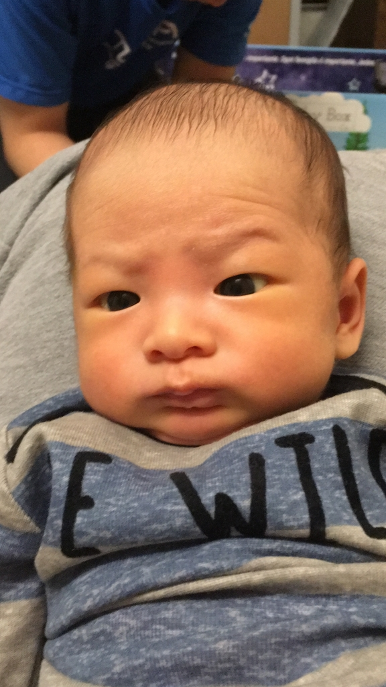
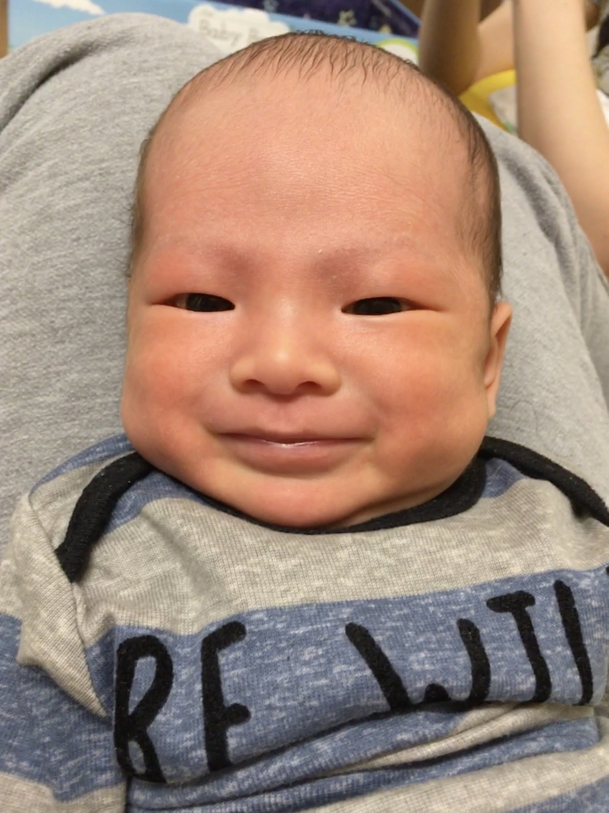
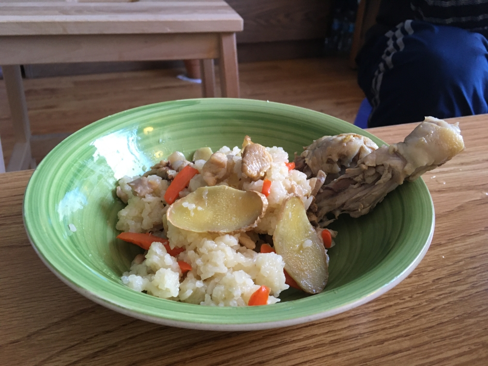
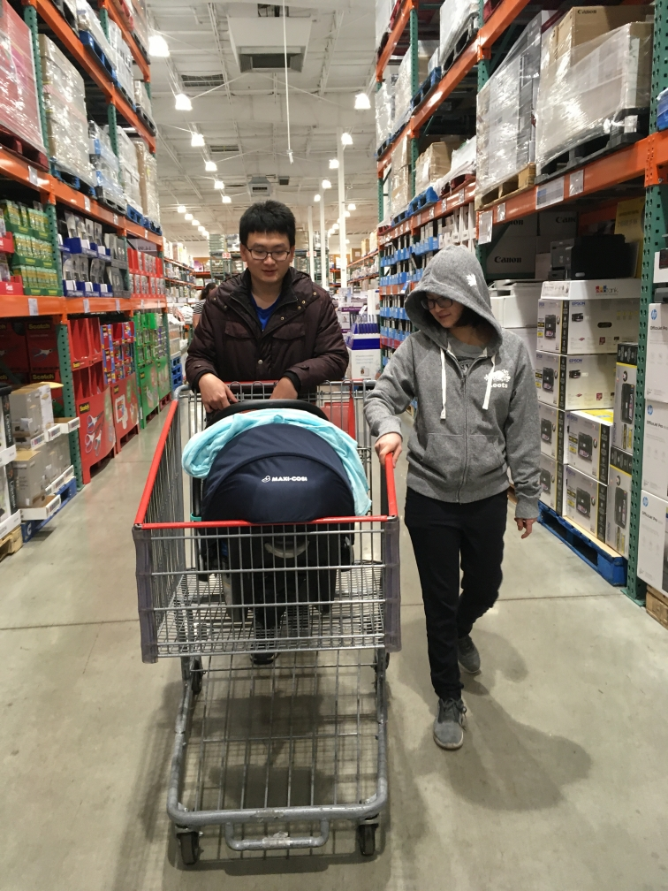
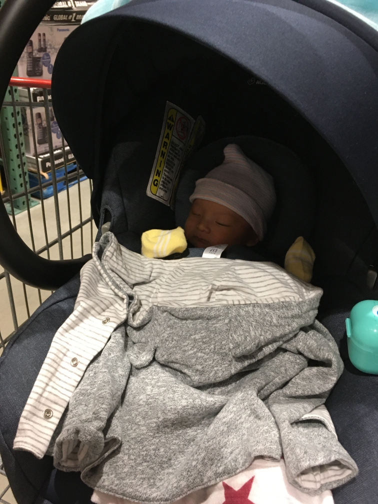
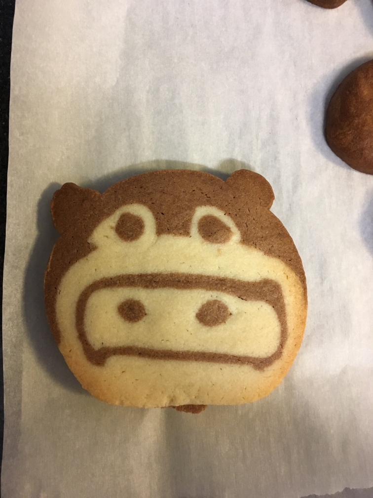
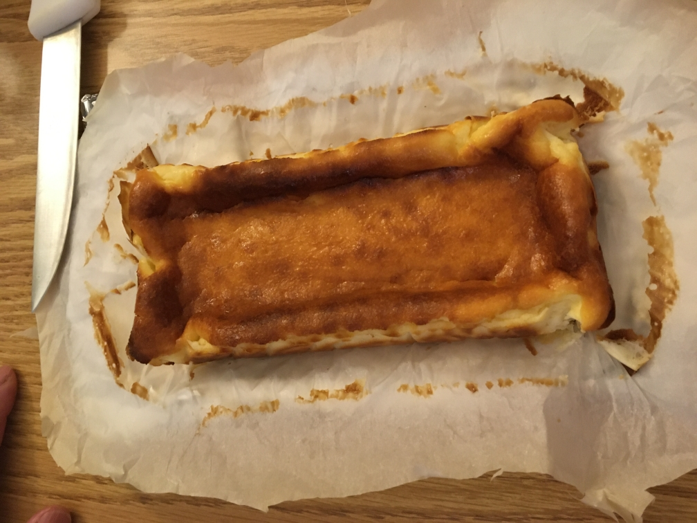
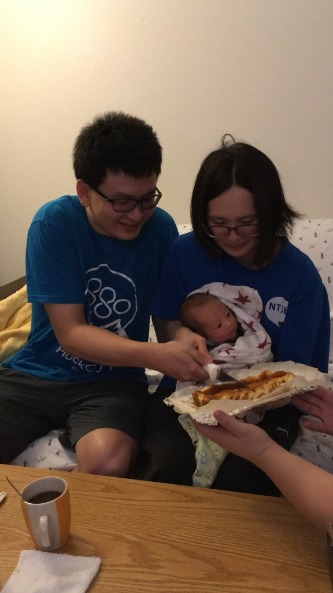
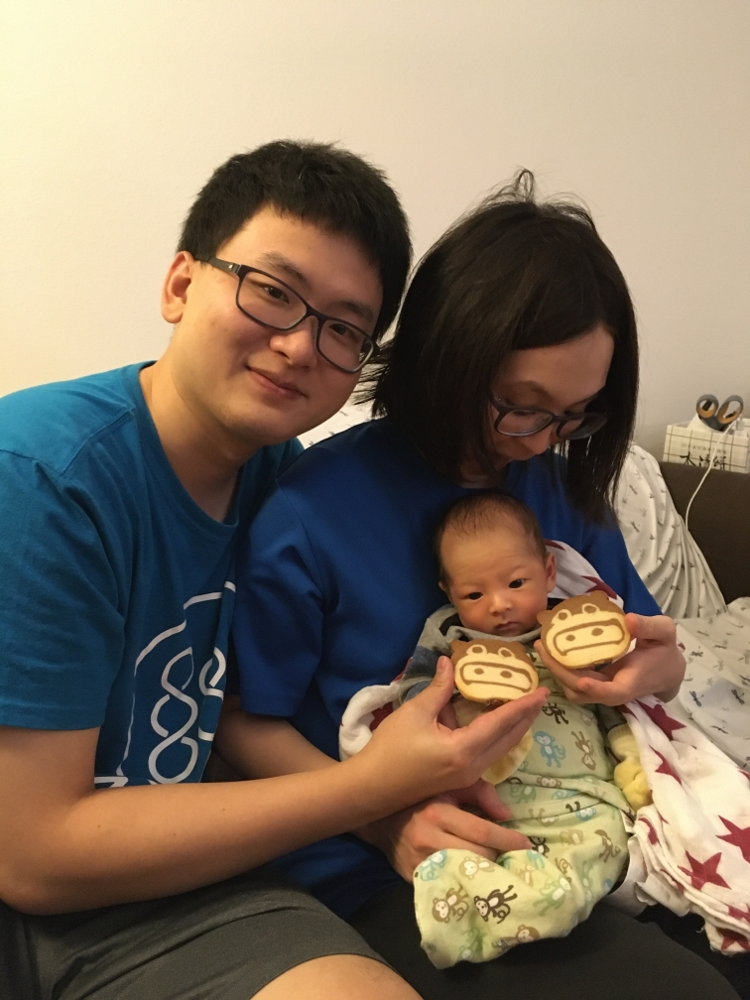

30天就在手忙腳亂之際匆匆的過去了，溜溜很快迎來自己的滿月，本來懶懶的沒有想要舉辦什麼特別的活動，但在小姨姨的幫助下做了蛋糕餅乾，也促成了溜溜的滿月紀念活動。以下我們先來採訪溜小弟：

溜溜你好，你知道今天你滿月了嗎？
<figure>
  
  <figcaption>滿月？那是什麼，能吃嗎？</figcaption>
</figure>

滿月就是你已經一個月大了，會有很多好吃的甜點跟油飯喔！（但是你吃不到）
<figure>
  
  <figcaption>哈哈真的喔！我沒有那麼棒啦</figcaption>
</figure>

## 油飯
阿嬤用心準備香噴噴的雞腿油飯

慶祝溜溜滿月的好康都給溜爸溜媽了 ^.<

## 溜搭溜搭
吃完晚餐後不知道為什麼變成滿月要帶溜溜出去逛逛，最後剛好就去 Costco 逛逛順便買菜囉～
<figure>
  
  <figcaption>GOGO 溜溜</figcaption>
</figure>

<figure>
  
  <figcaption>再長大一點就能真正坐在賣場的推車玩玩了</figcaption>
</figure>

## 吃甜點囉
回家之後就要來享用小姨姨親手做的甜點了！感謝小姨姨讚嘆小姨姨，沒有他繼續紀錄溜溜的生活的話，應該就沒有下一篇了 ^_^
<figure>
  
  <figcaption>真的是豬的豬豬餅乾</figcaption>
</figure>

<figure>
  
  <figcaption>很像起司蛋糕的蛋糕</figcaption>
</figure>

我們也很榮幸的請到溜溜持刀切下第1刀

還有跟可愛的豬豬餅乾合照

平安快樂的度過了這一天，爸媽希望你以後健康快樂的長大就好。（當然也會適當的磨練你就是了 XD）
